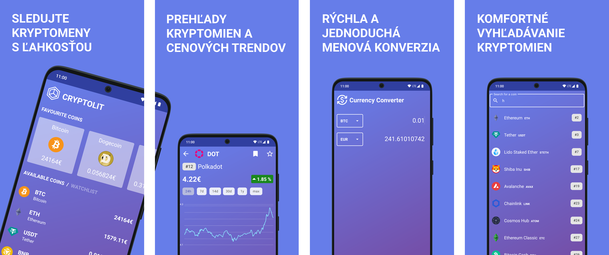

# Cryptolit - Crypto Tracker

## Track your favorite cryptocurrencies and their prices with Cryptolit app.

Cryptolit is a simple and user-friendly app that allows you to track the latest prices and trends of cryptocurrencies. Mark cryptocurrencies as your favorites and add them to your watchlist for easy access to all the important information in one place. Cryptolit also includes a convenient calculator. Whether you need to convert one cryptocurrency to another or calculate the value of your holdings, the built-in converter makes it simple and efficient. Cryptolit fetches data from the CoinGecko API.

Developed as a semester project for the Mobile Application Development course at the Faculty of Management and Informatics, University of Žilina, Cryptolit showcases the skills and knowledge gained during the course.

Stay updated on the crypto market with Cryptolit, the result of our commitment to mobile app development and our drive to deliver a valuable and user-friendly solution.

## Features
- 📈 Displays current cryptocurrency prices.
- 📊 Provides price history and charts.
- ⭐ Ability to track favorite cryptocurrencies.
- 💱 Provides conversion between cryptocurrencies and fiat currencies.

## Installation
Cryptolit is available on the Google Play. Click on the following link to install:

## Contact

👨‍💻 Developer: Dominik Ježík  
📧 Email: dominikjezik303@gmail.com  
🌐 Website: [dominikjezik.sk](https://dominikjezik.sk)

&nbsp;

# Cryptolit - Sledujte krypto

## Sledujte svoje obľúbené kryptomeny a ich ceny s aplikáciou Cryptolit.

Cryptolit je jednoduchá a intuitívna aplikácia, ktorá vám umožňuje sledovať najnovšie ceny a trendy kryptomien. Označte si kryptomeny ako obľúbené a pridajte ich do zoznamu sledovaných, aby ste mali jednoduchý prístup ku všetkým dôležitým informáciám na jednom mieste. Cryptolit obsahuje aj pohodlný kalkulátor. Či už potrebujete previesť jednu kryptomenu na inú alebo vypočítať hodnotu vášho portfólia, vstavaný konvertor vám to umožní jednoducho a efektívne. Cryptolit získava údaje pomocou CoinGecko API.

Táto aplikácia vznikla ako semestrálna práca pre predmet Vývoj aplikácií pre mobilné zariadenia na Fakulte riadenia a informatiky Žilinskej univerzity. Cryptolit predstavuje zručnosti a znalosti, ktoré sme nadobudli počas tohto kurzu.

Buďte v obraze s kryptomenovým trhom vďaka Cryptolit, výsledku našej oddanosti vo vývoji mobilných aplikácií a našej snahy poskytnúť hodnotné a jednoducho ovládateľné riešenie.

## Funkcie
- 📈 Zobrazuje aktuálne ceny kryptomien.
- 📊 Poskytuje históriu cien a grafy.
- ⭐ Možnosť sledovať obľúbené kryptomeny.
- 💱 Umožňuje prevod medzi kryptomenami a fiat menami.

## Inštalácia
Cryptolit je dostupný na platforme Google Play. Kliknite na nasledujúci odkaz na inštaláciu:

## Kontakt

👨‍💻 Vývojár: Dominik Ježík  
📧 Email: dominikjezik303@gmail.com  
🌐 Webová stránka: [dominikjezik.sk](https://dominikjezik.sk)

&nbsp;

Google Play and the Google Play logo are trademarks of Google LLC.